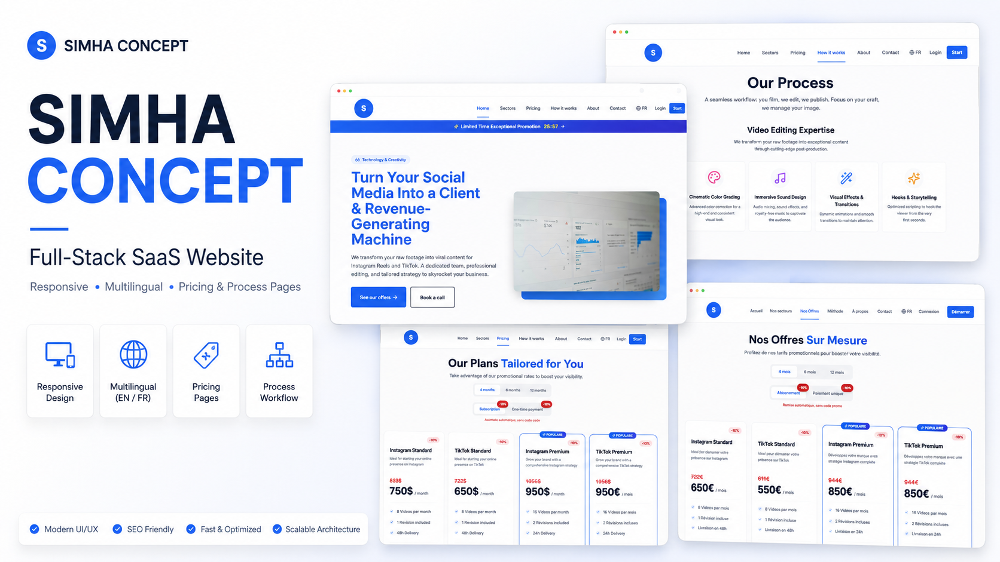

# Simha Concept Website

## Project Overview

SaaS-oriented website created for Simha Concept, a digital service brand focused on websites, branding, content creation and social media strategy.

The project presents the brand, its services and client journey through a clear structure, responsive layout and conversion-oriented user experience.

## Objectives

- Build a professional digital presence
- Present services clearly
- Structure the client journey
- Highlight web, branding and marketing services
- Make contact and inquiry actions easy
- Create a strong and consistent brand identity

## Approach

The website was structured around clarity, trust and conversion.

The goal was to present Simha Concept as a serious digital service brand while keeping the layout clean, modern and adapted to potential clients looking for web, branding and marketing solutions.

## Key Skills

- SaaS-oriented website structure
- Responsive layout
- User experience
- UI layout
- Content organization
- Visual hierarchy
- Conversion flow
- Digital brand presentation
- Service positioning

## Live Website

https://www.simhaconcept.com/

## Status

Completed
